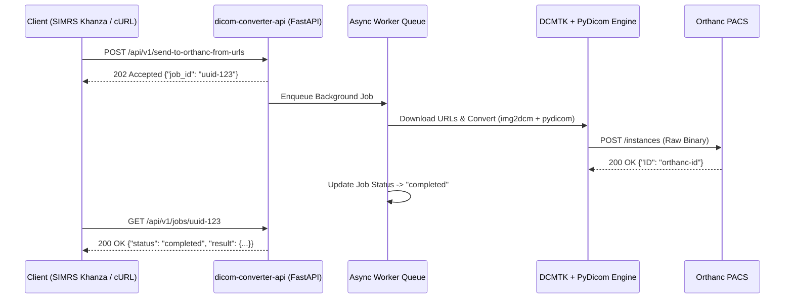

# dicom-converter-api — DICOM Conversion & Orthanc Integration REST API

[](https://www.python.org)
[](https://fastapi.tiangolo.com)
[](https://pydicom.github.io)
[](https://dicom.offis.de/dcmtk.php.en)
[](LICENSE)

A production-grade Python REST API for converting images (JPEG, PNG, BMP), PDFs, CDA documents, and STL 3D models into standards-compliant DICOM (`.dcm`) files using [DCMTK](https://dicom.offis.de/dcmtk.php.en) and [pydicom](https://pydicom.github.io) — with optional direct upload, native `pynetdicom` DICOM C-STORE SCU networking, and integration with [Orthanc PACS](https://www.orthanc-server.com/).

---

## Table of Contents

- [Features](#features)
- [Architecture](#architecture)
- [Prerequisites & System Dependencies](#prerequisites--system-dependencies)
- [Quick Start](#quick-start)
  - [Option A: Run System-Wide (Without venv)](#option-a-run-system-wide-without-venv)
  - [Option B: Run with Virtual Environment (venv)](#option-b-run-with-virtual-environment-venv)
  - [Option C: Run with Docker Compose](#option-c-run-with-docker-compose)
  - [Option D: Standalone Docker Container](#option-d-standalone-docker-container)
- [Configuration](#configuration)
- [API Reference](#api-reference)
  - [1. Health Check](#1-health-check)
  - [2. Convert Image to DICOM](#2-convert-image-to-dicom)
  - [3. Convert PDF to DICOM](#3-convert-pdf-to-dicom)
  - [4. Convert CDA to DICOM](#4-convert-cda-to-dicom)
  - [5. Convert STL to DICOM](#5-convert-stl-to-dicom)
  - [6. Convert \& Send to Orthanc (Async)](#6-convert--send-to-orthanc-async)
  - [7. Convert \& Send from URLs (Async)](#7-convert--send-from-urls-async)
  - [8. Poll Job Status](#8-poll-job-status)
  - [9. Find Study by Accession Number](#9-find-study-by-accession-number)
  - [10. Find Patient Studies](#10-find-patient-studies)
  - [11. Send Study to Modality](#11-send-study-to-modality)
- [DICOM Compliance \& Encoding](#dicom-compliance--encoding)
- [Project Structure](#project-structure)
- [License](#license)

---

## Features

| Feature | Description |
| :--- | :--- |
| **Image → DICOM** | Converts JPEG, BMP, PNG to Secondary Capture DICOM SOP instances |
| **PDF → DICOM** | Converts PDF files into Encapsulated PDF Storage DICOM objects |
| **CDA → DICOM** | Converts CDA XML documents into Encapsulated CDA DICOM objects |
| **STL → DICOM** | Converts 3D STL mesh models into Encapsulated 3D DICOM objects |
| **Single-Pass Conversion**| All DICOM tags (`PatientID`, `AccessionNumber`, `StudyDate`, etc.) are embedded directly during conversion |
| **PyDicom Refinement** | Refines DICOM metadata using `pydicom` to enforce UTF-8 (`ISO_IR 192`) character set compliance |
| **Send to Orthanc (Async)**| Converts & pushes DICOM files asynchronously to Orthanc PACS via HTTP REST (`POST /instances`) |
| **Send from URLs (Async)**| Downloads image/PDF URLs in background, converts to DICOM, and pushes to Orthanc |
| **Native DICOM C-STORE SCU**| Includes `pynetdicom` C-STORE module for native DICOM-to-DICOM network transfers over TCP 104/4242 |
| **Async Job Queue** | Non-blocking background worker execution with in-memory status tracking and TTL expiration cleanup |
| **Interactive OpenAPI Docs**| Auto-generated live API documentation at `http://<server>:8080/docs` |
| **100% Backward Compatible**| Drop-in replacement for SIMRS Khanza (`ApiOrthanc.java`) with identical JSON contracts |

---

## Architecture



---

## Prerequisites & System Dependencies

- **Python**: Version 3.10 or higher
- **DCMTK**: CLI binaries (`img2dcm`, `pdf2dcm`, `cda2dcm`, `stl2dcm`) must be installed on system `PATH`.

### Installing System Dependencies (Debian/Ubuntu/Linux Mint)

```bash
sudo apt-get update
sudo apt-get install -y dcmtk libgl1 libglib2.0-0 curl python3-pip
```

---

## Quick Start

### Option A: Run System-Wide (Without venv)

You can run the API directly using your system Python without creating a virtual environment:

```bash
cd /opt/dicom-converter-api

# Install dependencies globally to system site-packages
pip install --break-system-packages -r requirements.txt

# Start production server with 4 workers on port 8080
python3 -m uvicorn app.main:app --host 0.0.0.0 --port 8080 --workers 4
```

---

### Option B: Run with Virtual Environment (venv)

```bash
cd /opt/dicom-converter-api

# Create & activate virtualenv
python3 -m venv venv
source venv/bin/activate

# Install requirements
pip install -r requirements.txt

# Start development server with auto-reload
uvicorn app.main:app --host 0.0.0.0 --port 8080 --reload
```

---

### Option C: Run with Docker Compose

Launch the API alongside an Orthanc PACS container in an isolated container network:

```bash
cd /opt/dicom-converter-api

# Build and start background containers
docker-compose up -d --build

# Inspect real-time logs
docker-compose logs -f dicom-converter-api
```

---

### Option D: Standalone Docker Container

```bash
cd /opt/dicom-converter-api

# Build image
docker build -t dicom-converter-api .

# Run container
docker run -d -p 8080:8080 \
  -e ORTHANC_URL=http://192.168.1.100 \
  -e ORTHANC_PORT=8042 \
  --name dicom-converter-api dicom-converter-api
```

---

## Configuration

Settings can be specified via environment variables or an `.env` file in the root directory:

| Variable | Default | Description |
| :--- | :--- | :--- |
| `PORT` | `8080` | HTTP port for the FastAPI server |
| `HOST` | `0.0.0.0` | Bind IP host address |
| `LOG_LEVEL` | `INFO` | Logging level (`DEBUG`, `INFO`, `WARNING`, `ERROR`) |
| `ORTHANC_URL` | `""` | Orthanc PACS base URL (e.g. `http://192.168.1.100`) |
| `ORTHANC_PORT` | `"8042"` | Orthanc REST API port |
| `ORTHANC_USER` | `""` | Orthanc Basic Auth username |
| `ORTHANC_PASS` | `""` | Orthanc Basic Auth password |
| `JOB_TTL_HOURS`| `24` | Hours to keep completed background job results in memory |

---

## API Reference

### 1. Health Check
Checks server readiness, DCMTK binaries availability on system `PATH`, and background job stats.

- **URL**: `/health` or `/api/v1/health`
- **Method**: `GET`
- **Response**: `200 OK`
```json
{
  "status": "ok",
  "orthanc_configured": true,
  "orthanc_base_url": "http://orthanc:8042",
  "dcmtk_tools": {
    "img2dcm": true,
    "pdf2dcm": true,
    "cda2dcm": true,
    "stl2dcm": true
  },
  "job_stats": {
    "total_jobs": 5,
    "status_breakdown": {
      "completed": 5
    }
  }
}
```

---

### 2. Convert Image to DICOM
Converts an uploaded image file (JPEG, PNG, BMP) to a DICOM binary file (`.dcm`).

- **URL**: `/api/v1/convert/img2dcm`
- **Method**: `POST` (`multipart/form-data`)
- **Form Fields**:
  - `file`: Image binary data
  - `parameters`: JSON string containing DCMTK tags (`{"keys": ["Modality=CR", "PatientID=999"]}`)
- **Response**: `200 OK` (binary stream `application/dicom`)

---

### 3. Convert PDF to DICOM
Converts a PDF document to an Encapsulated PDF DICOM file.

- **URL**: `/api/v1/convert/pdf2dcm`
- **Method**: `POST` (`multipart/form-data`)
- **Form Fields**:
  - `file`: PDF file data
  - `parameters`: JSON string (`{"keys": [...]}`)
- **Response**: `200 OK` (binary stream `application/dicom`)

---

### 4. Convert CDA to DICOM
- **URL**: `/api/v1/convert/cda2dcm`
- **Method**: `POST` (`multipart/form-data`)

---

### 5. Convert STL to DICOM
- **URL**: `/api/v1/convert/stl2dcm`
- **Method**: `POST` (`multipart/form-data`)

---

### 6. Convert & Send to Orthanc (Async)
Uploads a file, converts it to DICOM with embedded tags, and pushes it directly to Orthanc PACS.

- **URL**: `/api/v1/send-to-orthanc`
- **Method**: `POST` (`multipart/form-data`)
- **Form Fields**:
  - `file`: File binary
  - `filetype`: `img`, `pdf`, `cda`, or `stl`
  - `parameters`: JSON string with tags (`{"keys": ["Modality=CR", "PatientID=123", "AccessionNumber=ACC001"]}`)
- **Response**: `202 Accepted`
```json
{
  "status": "success",
  "job_id": "8f3b20c2-5e4a-4318-9712-421d9ab5c812"
}
```

---

### 7. Convert & Send from URLs (Async)
Downloads images/PDFs from remote URLs in the background, converts them to DICOM, and pushes them to Orthanc.

- **URL**: `/api/v1/send-to-orthanc-from-urls`
- **Method**: `POST` (`application/json`)
- **Payload**:
```json
{
  "filetype": "img",
  "urls": [
    "http://192.168.1.5/webapps/radiologi/pages/upload/CR_001.jpg"
  ],
  "parameters": {
    "output_sop_class": "sec-capture",
    "keys": [
      "Modality=CR",
      "PatientID=999999999",
      "PatientName=JOHN DOE",
      "AccessionNumber=20260723001J000004",
      "StudyDate=20260723",
      "StudyDescription=CT SCAN",
      "InstitutionName=RS BEDAH SURYA DHARMA HUSADA"
    ]
  }
}
```
- **Response**: `202 Accepted`
```json
{
  "status": "success",
  "job_id": "c1782e44-8973-455b-b98a-21cbef901234"
}
```

---

### 8. Poll Job Status
Retrieves background job status and final upload details.

- **URL**: `/api/v1/jobs/{job_id}`
- **Method**: `GET`
- **Response**: `200 OK`
```json
{
  "id": "c1782e44-8973-455b-b98a-21cbef901234",
  "status": "completed",
  "progress": 100,
  "created_at": "2026-07-27T19:50:00+00:00",
  "updated_at": "2026-07-27T19:50:02+00:00",
  "result": {
    "upload": {
      "ID": "3313dc05-28478223-12dbcbfb-841659dc-c4369233",
      "ParentPatient": "45ab67cd-89ef0123-456789ab-cdef0123",
      "ParentSeries": "78cd90ef-12ab34cd-56ef78ab-90cd1234",
      "ParentStudy": "3313dc05-28478223-12dbcbfb-841659dc-c4369233",
      "Path": "/instances/3313dc05-28478223-12dbcbfb-841659dc-c4369233",
      "Status": "Success"
    }
  },
  "error": null
}
```

---

### 9. Find Study by Accession Number
- **URL**: `/api/v1/studies/find-by-acsn`
- **Method**: `POST` (`application/json`)
- **Payload**: `{"accession_number": "20260723001J000004"}`

---

### 10. Find Patient Studies
- **URL**: `/api/v1/patients/{patient_id}/studies`
- **Method**: `POST` (`application/json`)

---

### 11. Send Study to Modality
- **URL**: `/api/v1/studies/{study_id}/send-to-modality/{modality_ae}`
- **Method**: `POST` (`application/json`)

---

## DICOM Compliance & Encoding

1. **UTF-8 Support**: Every DICOM dataset created or converted by this API is refined with `pydicom` to set `SpecificCharacterSet = "ISO_IR 192"`. This guarantees proper handling of special characters, patient names, and hospital names.
2. **SOP Classes**:
   - `SecondaryCaptureImageStorage` (`1.2.840.10008.5.1.4.1.1.7`)
   - `EncapsulatedPDFStorage` (`1.2.840.10008.5.1.4.1.1.104.1`)
   - `EncapsulatedCDAStorage` (`1.2.840.10008.5.1.4.1.1.104.2`)
   - `EncapsulatedSTLStorage` (`1.2.840.10008.5.1.4.1.1.104.3`)

---

## Project Structure

```
/opt/dicom-converter-api/
├── app/
│   ├── main.py                  # FastAPI app & request timing middleware
│   ├── config.py                # Pydantic Settings & DCMTK tools status check
│   ├── models/                  # Pydantic v2 schemas
│   │   ├── convert.py           # Img2Dcm, Pdf2Dcm, Cda2Dcm, Stl2Dcm models
│   │   ├── job.py               # JobStatusResponse and SendToOrthancResponse models
│   │   └── orthanc.py           # Orthanc upload, search, and proxy models
│   ├── services/                # Core engines
│   │   ├── conversion.py        # Async DCMTK subprocesses + pydicom ISO_IR 192 metadata refinement
│   │   ├── orthanc_client.py    # Async httpx client for Orthanc REST API
│   │   ├── dicom_sender.py      # pynetdicom C-STORE SCU module
│   │   └── job_manager.py       # Thread-safe in-memory job queue with TTL expiration cleanup
│   └── routers/                 # Route handlers (13 endpoints)
│       ├── health.py            # /health & /api/v1/health
│       ├── convert.py           # /api/v1/convert/img2dcm, pdf2dcm, cda2dcm, stl2dcm
│       ├── jobs.py              # GET /api/v1/jobs/{id}
│       ├── send_to_orthanc.py   # POST /api/v1/send-to-orthanc & /api/v1/send-to-orthanc-from-urls
│       └── proxy.py             # Proxy endpoints (/studies/*, /patients/*, /orchestrate/*)
├── requirements.txt             # Dependency specification
├── Dockerfile                   # Multi-worker Python 3.12-slim + DCMTK Docker build
├── docker-compose.yml           # Compose stack for API + Orthanc PACS
└── README.md
```

---

## License

This project is licensed under the MIT License - see the [LICENSE](LICENSE) file for details.

---

## Credits

Original implementation by **Jaisyullah Rafiul Islam** for the **Transformation and Digitalization Team, Ministry of Health Indonesia** (Reference code: [jaisyullah/go-dcm](https://github.com/jaisyullah/go-dcm)).